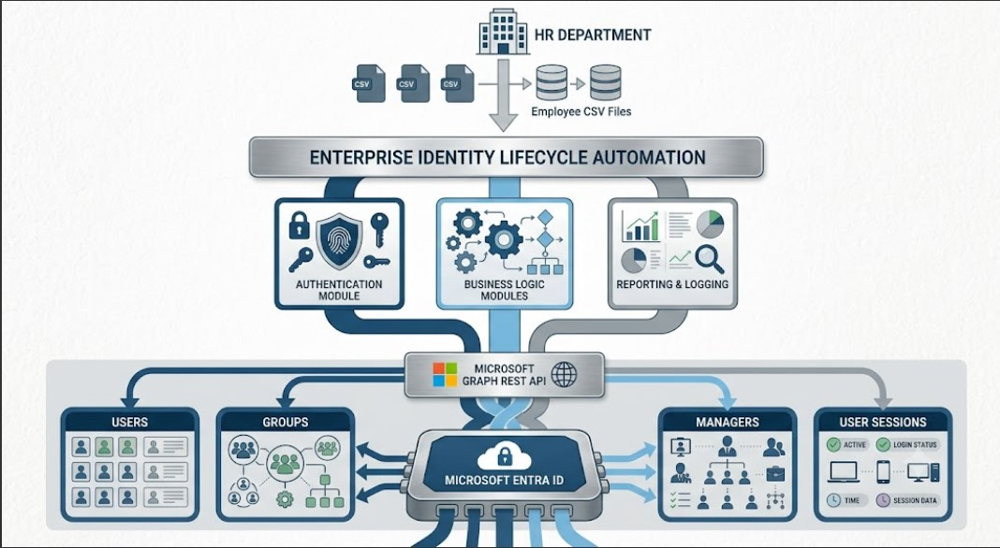

# Enterprise Identity Lifecycle Automation for Microsoft Entra ID

Automating the Joiner, Mover, and Leaver (JML) lifecycle using Microsoft Graph API and modular PowerShell automation.
---

## 📊 Project Highlights

• Complete Joiner, Mover and Leaver automation

• Microsoft Graph REST API integration

• Modular PowerShell architecture

• CSV-driven HR workflows

• Automated reporting and audit logging

• Microsoft Entra ID integration


> Automating the Joiner, Mover, and Leaver (JML) lifecycle in Microsoft Entra ID using Microsoft Graph API and modular PowerShell automation.

---

## 📖 Project Overview

Enterprise Identity Lifecycle Automation is a PowerShell-based automation solution that streamlines employee identity management within Microsoft Entra ID using the Microsoft Graph API.

The project automates the complete **Joiner, Mover, and Leaver (JML)** lifecycle by provisioning new users, updating existing employee information, and securely offboarding departing employees while maintaining centralized reporting and audit logging.

Rather than performing repetitive administrative tasks manually, the solution provides a structured and reusable automation framework suitable for enterprise identity management environments.

---

## 🎯 Business Problem

Identity administrators frequently perform repetitive user management tasks such as:

- Creating new employee accounts
- Updating employee information after department transfers
- Disabling accounts when employees leave
- Managing security group memberships
- Maintaining audit records

Performing these operations manually increases administrative effort, introduces inconsistencies, and raises the risk of configuration errors.

---

## 💡 Solution Overview

This project automates employee lifecycle management using Microsoft Entra ID and Microsoft Graph API through modular PowerShell scripts.

The automation includes:

- Employee Joiner Automation
- Employee Mover Automation
- Employee Leaver Automation
- Microsoft Graph REST API integration
- Department-based security group management
- Manager assignment
- CSV-driven processing
- Centralized reporting
- Audit logging

The project is designed using reusable PowerShell modules to improve maintainability, readability, and scalability.

---

# 🏗️ System Architecture

The solution follows a modular architecture where employee lifecycle events are processed through reusable PowerShell modules and Microsoft Graph API.

<p align="center">
  
</p>

The automation workflow consists of:

1. HR provides employee lifecycle data through CSV files.
2. PowerShell automation validates and processes the data.
3. Microsoft Graph API performs identity operations.
4. Microsoft Entra ID manages user identities and organizational relationships.
5. Reports and logs are generated for auditing and operational visibility.

---

# ⚙️ Key Features

### Employee Joiner

- Automated Microsoft Entra ID user provisioning
- User profile configuration
- Manager assignment
- Department-based security group assignment
- Provisioning report generation
- Audit logging

---

### Employee Mover

- Employee attribute updates
- Department changes
- Office location updates
- Company information updates
- Manager reassignment
- Security group transitions
- Movement reporting

---

### Employee Leaver

- Account disablement
- Active sign-in session revocation
- Security group removal
- Leaver reporting
- Audit logging

---

# 💻 Technology Stack

| Category | Technology |
|----------|------------|
| Identity Platform | Microsoft Entra ID |
| API | Microsoft Graph REST API |
| Automation | PowerShell |
| Authentication | OAuth 2.0 |
| Data Source | CSV |
| Reporting | CSV Reports |
| Logging | PowerShell Logging Module |
| Version Control | Git & GitHub |
| Development Environment | Visual Studio Code |

---

# 📁 Repository Structure

```text
enterprise-onboarding-automation
│
├── assets/
├── config/
├── diagrams/
├── docs/
├── input/
├── logs/
├── modules/
├── powershell/
├── reports/
├── screenshots/
│
├── README.md
└── .gitignore
```

The project is organized using a modular structure that separates configuration, automation scripts, reusable modules, documentation, reports, logs, and supporting assets for improved maintainability.

---

# 📚 Project Documentation

Detailed technical documentation is available in the `docs` directory.

| Document | Description |
|----------|-------------|
| Business-Requirements.md | Defines the business objectives and project requirements |
| Architecture.md | Describes the overall system architecture |
| Workflow.md | Explains the complete Joiner, Mover, and Leaver workflow |
| Joiner.md | Details the employee onboarding automation |
| Mover.md | Details the employee transfer automation |
| Leaver.md | Details the employee offboarding automation |
| Graph-Endpoints.md | Lists all Microsoft Graph API endpoints used |
| RBAC-Design.md | Explains the security group and access control design |
| User-Lifecycle.md | Documents the employee identity lifecycle |

---

# 🌐 Microsoft Graph API Operations

The project uses Microsoft Graph REST API to perform identity lifecycle operations.

| Operation | HTTP Method |
|-----------|-------------|
| Obtain Access Token | POST |
| Create User | POST |
| Get Users | GET |
| Update User | PATCH |
| Assign Manager | PUT |
| Add User to Group | POST |
| Remove User from Group | DELETE |
| Revoke Sign-In Sessions | POST |

---

# 📸 Project Screenshots

The `screenshots` folder contains evidence of the automation process, including:

- Employee Joiner workflow
- Employee Mover workflow
- Employee Leaver workflow
- Microsoft Entra ID user management
- Security group assignments
- Reports
- Audit logs
- Final project structure

---

# 🚀 Future Enhancements

Potential improvements for future versions include:

- Microsoft Entra Conditional Access integration (Premium licensing required)
- Microsoft Entra Privileged Identity Management (PIM)
- Azure Automation Runbooks
- ServiceNow HR integration
- Email notifications
- GUI-based administration console
- HTML reporting dashboard

---

# 🎓 Lessons Learned

Developing this project provided practical experience in:

- Identity lifecycle automation
- Microsoft Entra ID administration
- Microsoft Graph REST API integration
- Modular PowerShell scripting
- RBAC through security groups
- Enterprise documentation
- Reporting and audit logging
- Git and GitHub project management

---

# 👨‍💻 Author

**Abdullah Nazim**

MSc Cybersecurity

Interested in Identity & Access Management (IAM), Microsoft Entra ID, Microsoft Graph API, PowerShell automation, and enterprise identity security.

---

## License

This project is intended for educational, portfolio, and learning purposes.